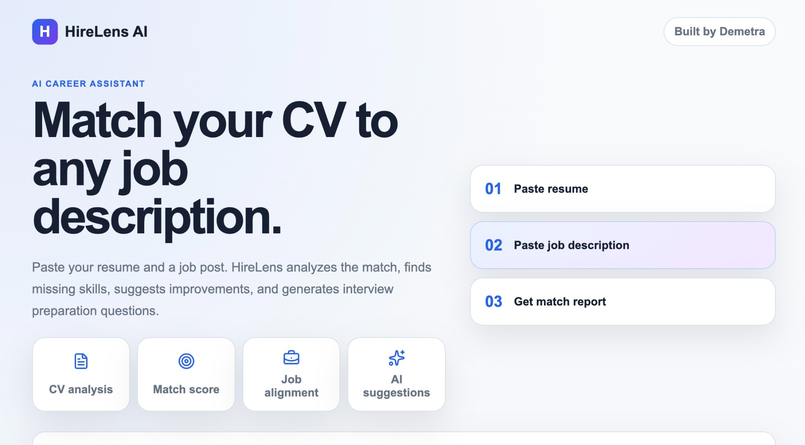
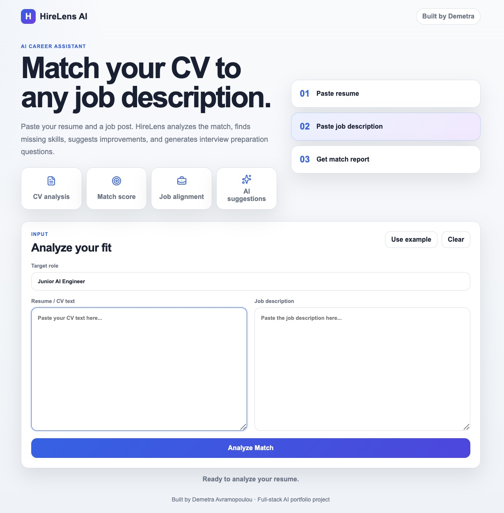
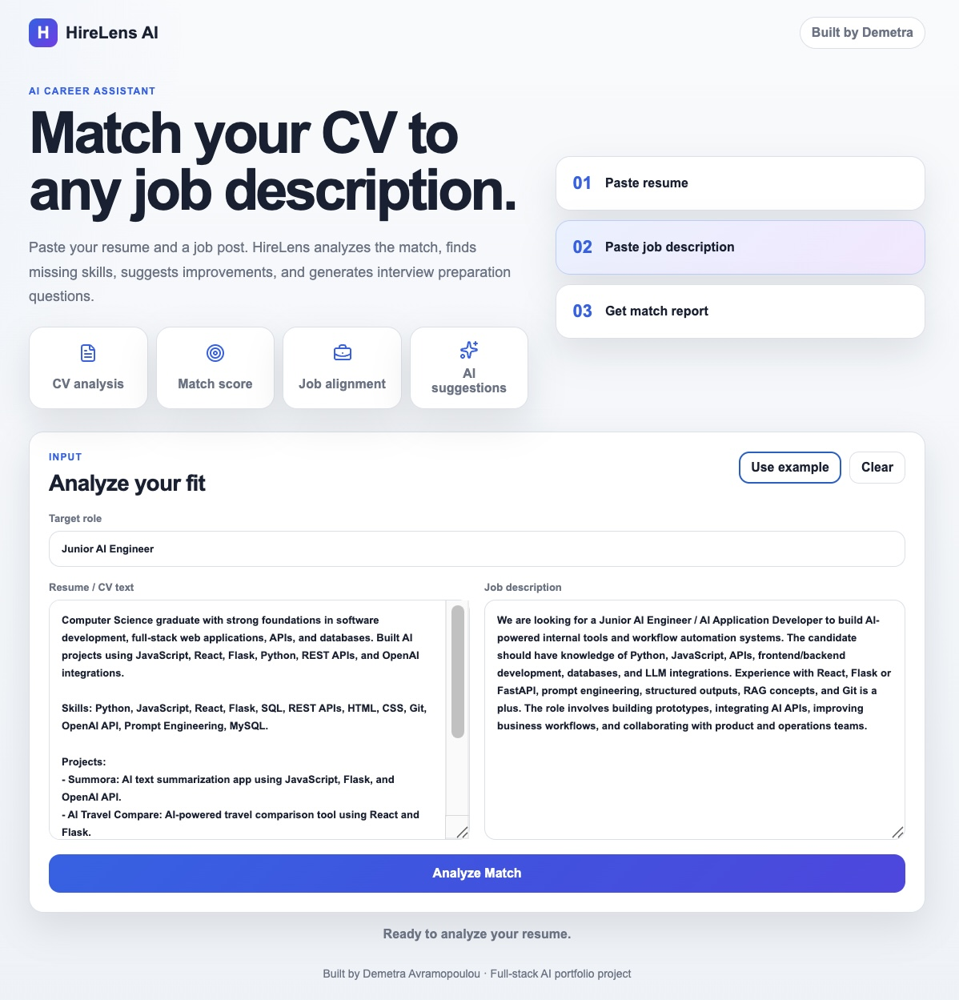
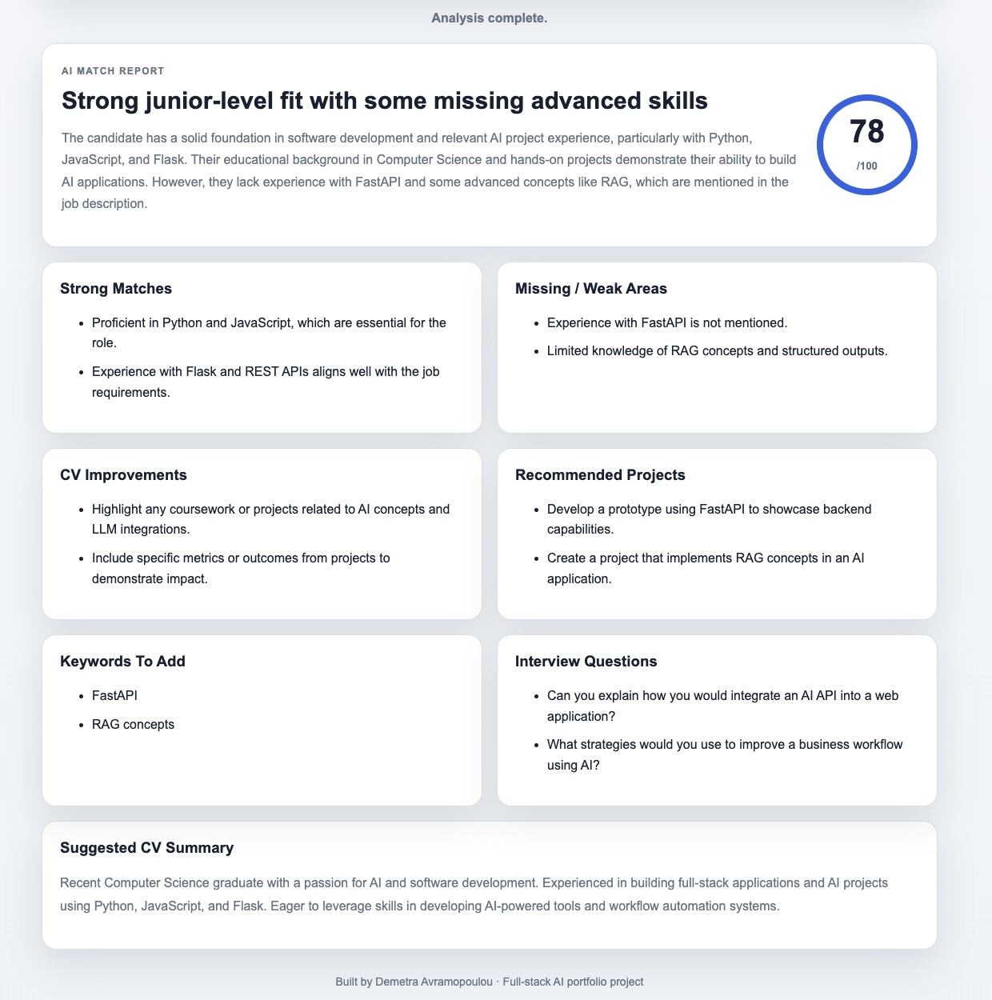

# HireLens AI

HireLens AI is a full-stack AI application that helps job seekers evaluate how well their resume matches a target job description.

The application analyzes a candidate's resume against a specific role and generates a structured report highlighting strengths, skill gaps, improvement opportunities, keywords to add, and interview preparation questions.

## Features

- Resume and job description analysis
- AI-generated compatibility score
- Skill-gap identification
- CV improvement suggestions
- Interview preparation questions
- Suggested professional summary
- Support for OpenAI and Anthropic models
- Demo mode for testing without API keys
- Structured JSON-based AI responses

## Screenshots

### Home Screen

The landing page introduces HireLens AI and highlights the application's core features.



### Resume & Job Description Input

Users can paste their resume and a target job description to start the analysis.



### Example Analysis Setup

Example resume and job description data loaded into the application before running the analysis.



### AI Match Analysis Report

The generated report includes a match score, strengths, skill gaps, CV improvement suggestions, recommended projects, keywords, and interview preparation questions.



## Architecture

### Frontend

- React
- Vite
- JavaScript
- CSS

### Backend

- Python
- Flask
- Flask-CORS
- REST API

### AI Layer

- OpenAI API
- Anthropic API
- Prompt Engineering
- Structured JSON Outputs

## Workflow

1. User submits a resume and job description.
2. Frontend sends the data to the Flask backend.
3. Backend validates the request and generates a structured prompt.
4. OpenAI or Anthropic processes the request.
5. The response is parsed as structured JSON.
6. The frontend displays the analysis report.

## Project Structure

```text
hirelens-ai/
├── backend/
│   ├── app.py
│   ├── requirements.txt
│   └── .env.example
│
├── frontend/
│   ├── .env.example
│   ├── index.html
│   ├── package.json
│   └── src/
│       ├── App.jsx
│       ├── main.jsx
│       ├── styles.css
│       └── components/
│           ├── MatchForm.jsx
│           └── ResultPanel.jsx
│
├── screenshots/
│   ├── home-screen.jpg
│   ├── input-form.jpg
│   ├── example-analysis.jpg
│   └── results-report.jpg
│
├── .gitignore
└── README.md
```

## Technologies Used

### Frontend

- React
- Vite
- JavaScript
- CSS

### Backend

- Python
- Flask
- Flask-CORS

### AI Integration

- OpenAI API
- Anthropic API
- Prompt Engineering
- Structured JSON Outputs

### Development Tools

- Git
- GitHub
- VS Code

## Key Concepts Demonstrated

- Full-stack application development
- REST API design
- Frontend/backend communication
- OpenAI API integration
- Anthropic API integration
- Prompt engineering
- Structured AI responses
- Environment variable management
- Input validation
- Error handling for API-based applications

## Running Locally

### 1. Start the Backend

```bash
cd backend
python3 -m venv venv
source venv/bin/activate
pip install -r requirements.txt
cp .env.example .env
python3 app.py
```

On Windows, activate the virtual environment with:

```bash
venv\Scripts\activate
```

The backend runs at:

```text
http://127.0.0.1:5000
```

### 2. Start the Frontend

Open a second terminal:

```bash
cd frontend
npm install
cp .env.example .env
npm run dev
```

The frontend runs at:

```text
http://localhost:5173
```

## Environment Variables

Create a `.env` file inside the `backend` directory.

### Demo Mode

Demo mode works without paid API keys:

```env
AI_PROVIDER=demo
```

### OpenAI Mode

```env
AI_PROVIDER=openai
OPENAI_API_KEY=your_openai_api_key_here
OPENAI_MODEL=gpt-4o-mini
```

### Anthropic Mode

```env
AI_PROVIDER=anthropic
ANTHROPIC_API_KEY=your_anthropic_api_key_here
ANTHROPIC_MODEL=claude-3-5-haiku-latest
```

After changing the provider, restart the backend.

### Frontend API URL

Create a `.env` file inside the `frontend` directory if you need to change the backend URL:

```env
VITE_API_URL=http://127.0.0.1:5000/analyze-match
```

## Security Note

Do not upload `.env` to GitHub. The repository includes `.gitignore` rules to prevent local environment files, virtual environments, dependencies, and build files from being committed.

The backend also includes a character limit for resume and job description inputs to reduce accidental high-cost API requests.

## Suggested GitHub Repository Description

```text
Full-stack AI application that analyzes resumes against job descriptions using OpenAI and Anthropic APIs.
```

## Suggested GitHub Topics

```text
react flask python openai anthropic ai llm prompt-engineering resume-analyzer full-stack
```

## Future Improvements

- PDF resume upload
- Export analysis reports as PDF
- Saved analysis history
- Resume version comparison
- Job description URL import
- Cloud deployment

## Author

Demetra Avramopoulou
